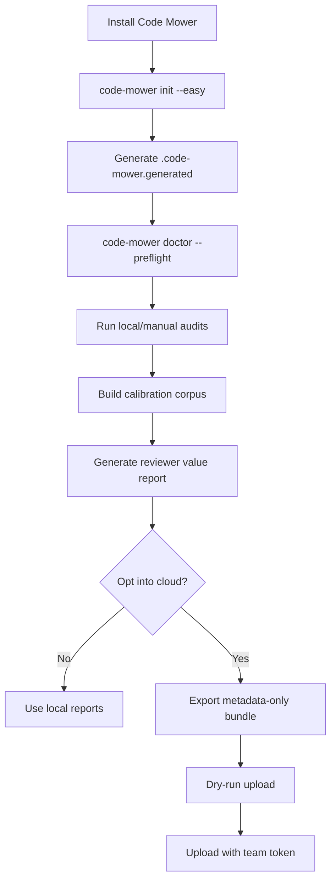

# Architecture

Code Mower is a local-first CLI plus generated GitHub support files. It helps a
team set up AI reviewer lanes, run diagnostics, calibrate those lanes against
known PR outcomes, and optionally upload sanitized metadata to CodeMower.com.

## Core Concepts

- **Profile:** a named setup posture, such as easy-mode local/manual lanes.
- **Provider:** an adapter for a reviewer or coding system such as Codex,
  Claude, Gitar, Antigravity/Gemini, Hermes, CodeRabbit, Cursor BugBot, Qodo,
  Greptile, Devin, or a local LLM.
- **Lane:** a provider plus trigger policy, prompt/lens, and merge posture.
- **Lens:** a review doctrine that changes what a reviewer looks for, without
  changing the underlying provider.
- **Context pack:** a bounded set of surrounding files that can be supplied to
  reviewers when a diff alone is insufficient.
- **Calibration corpus:** known-clean, known-blocked, or subtle-risk PRs used
  to measure reviewer usefulness.
- **Value report:** a local report that compares useful findings, false
  positives, cost, latency, and lane recommendations.
- **Run role:** a normalized purpose for a measured event, such as
  `implement`, `review`, `calibrate`, `release`, or `explore`.
- **Builder experiment:** a bounded authoring run that measures which builder
  plus reviewer loop produces verified code with the best quality, speed, and
  cost.
- **Cloud bundle:** an inspectable metadata-only export that can optionally be
  uploaded to CodeMower.com.

## Package Layout

```text
src/code_mower/
  cli.py                         command routing
  init.py                        easy-mode generated setup
  doctor.py                      thin doctor CLI adapter
  doctor_checks/                 runtime, provider, GitHub, cost, cloud, output checks
  provider_registry.py           provider metadata and posture
  prompts.py                     lane prompt loading
  reviewer_metrics.py            reviewer value/report calculations
  cloud.py                       thin cloud CLI adapter
  cloud_client/                  export, upload, setup, doctor, events, operations
  package_paths.py               package materializer provider-template path helpers
  migration.py                   package install and mirror-removal rehearsals
  *_audit_pr.py                  provider-specific audit runners
  adapters/                      hosted/SaaS adapter helpers
  lane_configs/                  provider lane declarations
  templates/                     generated config, workflows, prompts, support
tests/                           unit and release-hygiene tests
scripts/                         smoke, privacy, fresh-clone, Python wrapper
docs/                            public setup, privacy, roadmap, release docs
```

The package intentionally keeps provider-specific behavior in adapters and lane
configs. Generic orchestration should not know provider-specific auth quirks
unless they are part of the declared provider contract.

## Local Runner And Optional Cloud

Code Mower's security model depends on a simple split:

- local runners hold source code, diffs, provider credentials, GitHub tokens,
  worktrees, raw transcripts, and raw command output;
- generated GitHub support files coordinate labels, comments, workflows, and
  wrapper entrypoints in the user's repository; and
- CodeMower.com receives only explicit, metadata-only uploads when the user opts
  in.

The hosted service should not be required for install, doctor, first audit, or
local value reports. It exists to turn repeated sanitized events into private
team dashboards and eventually aggregate benchmarks.

## First-Run Flow



## Provider And Lane Posture

Code Mower starts conservative:

- local structured audits first;
- hosted reviewers informational until calibrated;
- no recurring schedules by default;
- no merge-gating lane until that repo's data supports it; and
- no cloud upload unless explicitly configured.

Provider integrations should expose setup docs, auth/runtime doctor checks,
source/diff exposure posture, local/hosted/manual/automatic posture, and
cost/latency fields when available.

## Builder And Orchestrator Boundary

Code Mower can learn from orchestrator systems without becoming one by default.
The v1.0 architecture should keep the first builder-experiment layer
harness-only:

- one task contract per run;
- one worktree/branch per builder attempt;
- provider/lens/context-pack metadata captured as structured events;
- reviewer isolation through diff plus task contract rather than builder
  transcript;
- normal Code Mower audit gates before merge; and
- optional metadata upload after local inspection.

Future orchestrator adapters can drive authoring sessions, but the public core
should first make the measurement loop reliable and source-free by default.

## Generated Product Support

`code-mower init --easy --apply` writes generated support files into a target
directory. Product repositories should treat generated files as reviewable
configuration and thin wrappers, not as a fork of the implementation.

The long-term rule is: product repos consume a pinned package version and keep
only product-specific config/support files.

## Cloud Boundary

The OSS package can export and upload a cloud bundle, but the hosted service is
optional. Default bundles exclude source code, raw diffs, raw model
transcripts, raw stdout/stderr, auth output, and secrets.

See `docs/cloud-data-contract.md` for the public upload contract.

## Release Hygiene

Before a public alpha promotion, run:

```bash
scripts/dev-python -m venv .venv
.venv/bin/python -m pip install -e . ruff
.venv/bin/python -m ruff check .
.venv/bin/python -m unittest discover -s tests
.venv/bin/python -m pytest -q
.venv/bin/python scripts/privacy_scan.py
.venv/bin/python scripts/smoke_easy_mode.py --code-mower-bin .venv/bin/code-mower --json
.venv/bin/python scripts/fresh_clone_rehearsal.py --repo-url . --ref HEAD --python .venv/bin/python --json
git diff --check
```

`scripts/dev-python` is the preferred source-checkout Python entrypoint. It
refuses stale or old Python interpreters so release work does not accidentally
run under an unsafe ambient `python3`.
