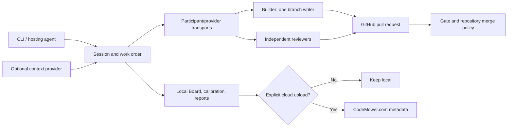
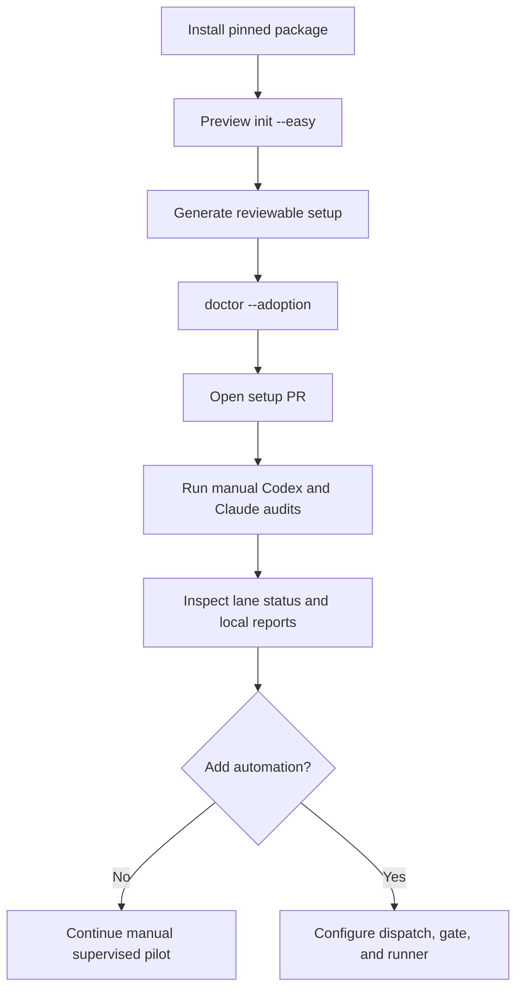

# Architecture

Code Mower is a local-first Python CLI plus generated GitHub support files. It
coordinates supervised AI builder and reviewer lanes, records bounded evidence,
and can optionally upload sanitized metadata to CodeMower.com.

## Product Boundaries

Code Mower owns:

- participant and role selection;
- operating briefs, work orders, local session leases, and recovery state;
- builder provenance and delivery outcomes;
- reviewer invocation, structured verdicts, and current-head validity;
- calibration, lane-promotion evidence, and local reports;
- generated GitHub labels, workflows, gates, and support wrappers;
- guarded tracker operations; and
- explicit context and cloud-data boundaries.

Provider products still own their models, authentication, execution sandboxes,
usage charges, and product-specific sessions. GitHub remains authoritative for
pull requests, checks, and merge state. Selecting a provider does not grant it
review or merge authority.

## Core Concepts

- **Participant:** a selected product identity such as Claude, Codex, or Devin.
- **Provider transport:** the CLI, API, GitHub app, or manual handoff used for a
  participant's specific job.
- **Orchestrator:** the hosting agent by default; coordinates assignments,
  evidence, reviews, and recovery.
- **Builder:** the single writer for one branch.
- **Reviewer lane:** a provider plus trigger, prompt/lens, verdict contract, and
  merge posture.
- **Context provider:** a source of approved bounded evidence. It is separate
  from participant roles.
- **Session:** a local operating brief, selected participants, optional work
  item/context association, and single-orchestrator lease.
- **Calibration corpus:** known-clean, known-blocked, or subtle-risk cases used
  to measure reviewer usefulness.
- **Builder experiment:** a source-free measurement record for an authoring
  attempt and its review/merge outcome.
- **Cloud bundle:** an inspectable export that uploads only after an explicit
  command.

## Runtime Shape


```mermaid
flowchart LR
  U["CLI / hosting agent"] --> S["Session and work order"]
  S --> P["Participant/provider transports"]
  P --> B["Builder: one branch writer"]
  P --> R["Independent reviewers"]
  C["Optional context provider"] --> S
  B --> G["GitHub pull request"]
  R --> G
  G --> M["Gate and repository merge policy"]
  S --> L["Local Board, calibration, reports"]
  L --> X{"Explicit cloud upload?"}
  X -->|No| K["Keep local"]
  X -->|Yes| H["CodeMower.com metadata"]
```

`code-mower session start` creates the operating state and lease. It does not
act as a universal process launcher. The host invokes a maintained local or
hosted transport where one exists and otherwise records an explicit handoff.

## Package Layout

```text
src/code_mower/
  cli.py                         top-level command routing
  init.py, next_steps.py         setup and first-run guidance
  session.py                     participant brief and orchestrator lease
  context_session.py             protected guided context state
  context_guided.py              prepare/deliver/attach/feedback workflow
  context_*.py                   connection, packet, delivery, and review contracts
  doctor.py                      thin doctor CLI adapter
  doctor_checks/                 runtime, provider, GitHub, tracker, cloud checks
  participants.py               participant identity and role mapping
  provider_registry.py           reviewer lane metadata and posture
  providers/                     shared provider metadata helpers
  provider_runners/              checkout, process, verdict, and GitHub primitives
  lane_configs/                  provider-specific lane declarations
  *_audit_pr.py                  provider-specific audit adapters
  work_orders.py                 planning and implementation contracts
  builder_runs.py                source-free builder provenance
  calibration/                   corpus, evidence, policy, metrics, reports
  tracker_*.py, jira_*.py        work-item contracts and guarded Jira operations
  cloud.py, cloud_client/        export, upload, setup, and metadata operations
  package_*.py, migration_*.py   generated package and rehearsal support
  templates/                     generated config, workflows, prompts, wrappers
tests/                           behavior, privacy, and release-hygiene tests
scripts/                         smoke, privacy, fresh-clone, and Python helpers
docs/                            current guides and historical release records
```

Shared provider-runner modules implement stable mechanics such as isolated PR
checkouts, subprocess cleanup, verdict artifacts, and GitHub posting. Provider
adapters retain authentication, sandbox, prompt, parser, and API differences.
The goal is one role contract, not identical vendor mechanics.

## Session And Participant Contract

Participant selection is independent from role and merge authority. A session
stores normalized participants and host identity. Repository configuration and
the reviewer registry decide which transports and review policies apply.

One local working copy can have one mutating orchestrator lease. One PR branch
can have one writer. These are different controls: the session lease prevents
two orchestrators from coordinating the same working copy, while the branch
rule prevents a reviewer or second builder from changing the owner's branch.

Codex, Claude Code, and Cursor are qualified session hosts in v1.3.1. Other host
identities can receive the same brief and telemetry shape, but Code Mower does
not claim execution parity until the relevant transport and recovery behavior
are qualified. See [Participants And Sessions](sessions.md).

## Review And Merge Contract

Reviewers consume the PR diff and task/context contract, not the builder's raw
transcript. Structured verdicts bind to the exact PR head. When required
context is selected, they also bind to the current context input revision.

Generated workflows clear stale terminal audit labels after the head changes.
The repository gate combines current trusted verdict evidence with configured
policy. A reviewer starts informational unless its repository-specific
known-clean and known-blocked evidence supports promotion.

The private [Devin review adapters](devin-review-parity.md) normalize local CLI
and hosted v3 evidence over the existing remote lifecycle. Both remain
informational and revalidate the current head and context before consumption.

## Context Contract

Context connections are private machine state. Repository configuration stores
only a generic connection alias and policy. Packets retain bounded evidence,
citations, provenance, expiry, and integrity metadata in a protected local
store.

The provider adapter may fetch or authorize evidence, but the common Code Mower
packet, delivery, attachment, and review contracts decide how it enters a work
order or review. Every delivery reauthorizes. Context providers gain no role or
tracker authority. See [Context Provider Contract](context-provider-contract.md).

## Tracker Contract

`code_mower.trackerWorkItem.v1` normalizes a bounded work item. GitHub Issues is
the default. Jira Cloud is opt-in; queue reads and all writes use Code Mower's
REST transport. Writes require both repository configuration and an explicit
apply command and are revalidated against live scope. Connected Atlassian MCP
can enrich local reading but cannot authorize a mutation. See
[Work Tracker Data Contract](tracker-data-contract.md).

## Local And Cloud Boundary

Local runners hold source, diffs, credentials, worktrees, prompts, raw provider
output, and private context. The Board reads redacted local/GitHub metadata and
serves on loopback. It does not upload data.

Cloud export is a separate explicit operation. Default uploads exclude source,
raw diffs, raw model transcripts, raw stdout/stderr, auth output, issue body
text, credentials, and private context. Provider verdict artifacts and cloud
events pass Code Mower-owned schema and privacy validation before posting or
upload. See [Cloud Data Contract](cloud-data-contract.md).

## First-Run Flow


```mermaid
flowchart TD
  A["Install pinned package"] --> B["Preview init --easy"]
  B --> C["Generate reviewable setup"]
  C --> D["doctor --adoption"]
  D --> E["Open setup PR"]
  E --> F["Run manual Codex and Claude audits"]
  F --> G["Inspect lane status and local reports"]
  G --> H{"Add automation?"}
  H -->|No| I["Continue manual supervised pilot"]
  H -->|Yes| J["Configure dispatch, gate, and runner"]
```

Automation credentials and auto-merge configuration follow the first manual
audit. Optional Coworker context, additional participants, Jira, and cloud
sharing are independent additions.

## Release Validation

From a contributor checkout:

```bash
scripts/dev-python -m venv .venv
.venv/bin/python -m pip install -e ".[test]"
.venv/bin/python -m ruff check .
.venv/bin/python -m unittest discover -s tests
.venv/bin/python scripts/privacy_scan.py
.venv/bin/python scripts/smoke_easy_mode.py \
  --code-mower-bin .venv/bin/code-mower --json
.venv/bin/python scripts/fresh_clone_rehearsal.py \
  --repo-url . --ref HEAD --python .venv/bin/python --json
git diff --check
```

Package-index publication and live provider campaigns are separate release
checks. See [Public Release Checklist](public-release-checklist.md) and
[Release Qualification](release-qualification.md).
